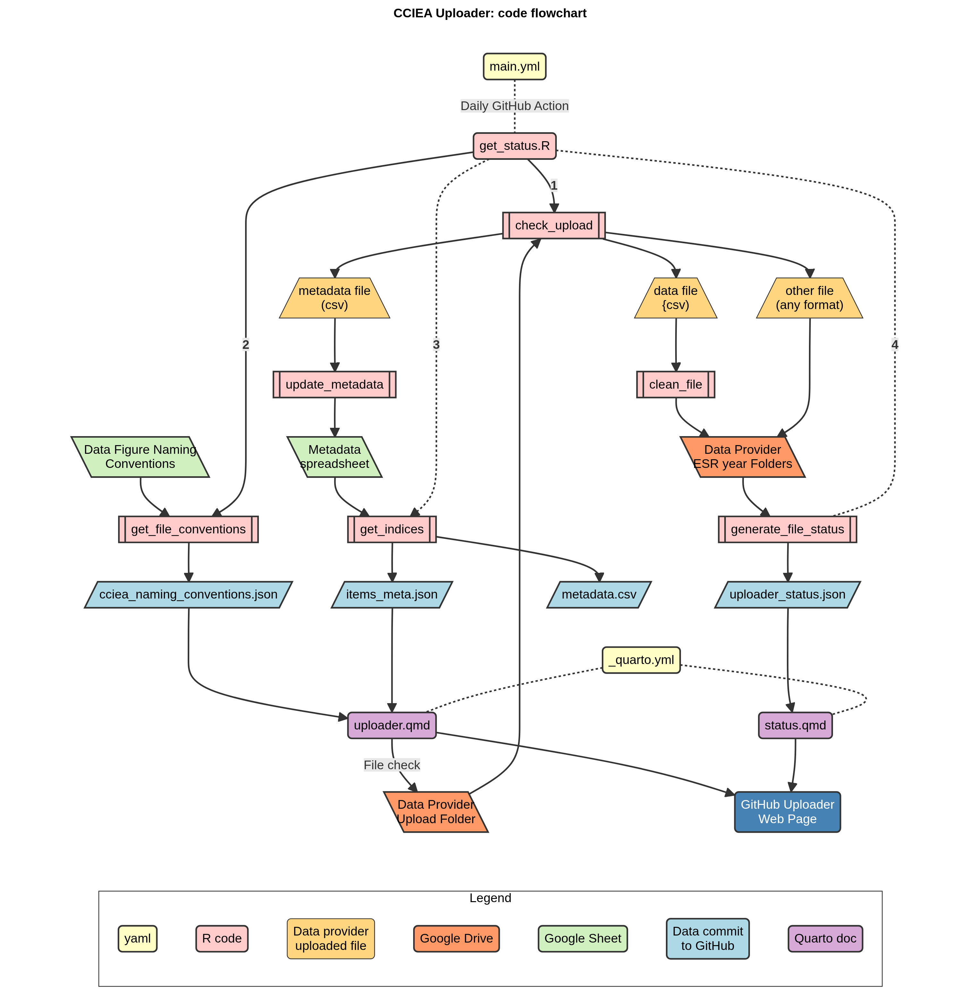

- [California Current Integrated Ecosystem Assessment (CCIEA)
  Uploader](#california-current-integrated-ecosystem-assessment-cciea-uploader)
  - [About](#about)
  - [Code](#code)
  - [CCIEA Resources](#cciea-resources)

## California Current Integrated Ecosystem Assessment (CCIEA) Uploader

### About

The CCIEA Uploader is an on-line resource for uploading, standardizing,
and organizing CCIEA indicator data for each Ecosystem Status Report
year each CCIEA Data Provider.

The uploader provides:

- Daily status of uploaded data
- View of current metadata
- Downloads of previous data and metadata
- A location to upload new data
- Real-time checks that data to be uploaded follows basic CCIEA file
  conventions

### Code

The code in this repository consists of GitHub actions and a Quarto
Document written in R and OJS.

- **Github Action** - runs daily at 6 am
  - main.yaml: get_status.R
    - libraries: tidyverse (uses: jsonlite, tibble, dplyr, googledrive,
      googlesheets4)
    - loads: \_init.R, \_gdrive.R, \_pi_folders_to_json.R  
    - runs:
      1.  generate_file_status()
          - input: Google Drive folders
          - output: uploader_status.json
      2.  get_indices()
          - input: metadata.csv
          - output: items_meta.json
      3.  get_file_conventions()
          - input: file name conventions
          - output: cciea_naming_conventions.json
- **Web Page** (Quarto)
  - \_quarto.yml
    - uploader.qmd
      1.  code: Markdown, OJS/html
      2.  input:items_meta.json, cciea_naming_conventions.json
    - status.qmd
      1.  code: R, OJS, flextable
      2.  format: html:grid
      3.  includes:
          - \_pi_folders_to_df.qmd, libraries: flextable, jsonlite,
            tibble, officer
          - \_init.qmd
      4.  input: uploader_status\_\[esr_year\].json

The basic code flow is as follows:

### CCIEA Resources

- CCIEA Web pages:
  <https://www.integratedecosystemassessment.noaa.gov/regions/california-current>
- Ecosystem Status Reports:
  <https://www.integratedecosystemassessment.noaa.gov/regions/california-current/california-current-reports>
- Technical Documentation:
  <https://cciea-esr.github.io/ESR-Technical-Documentation-FY2025/>
